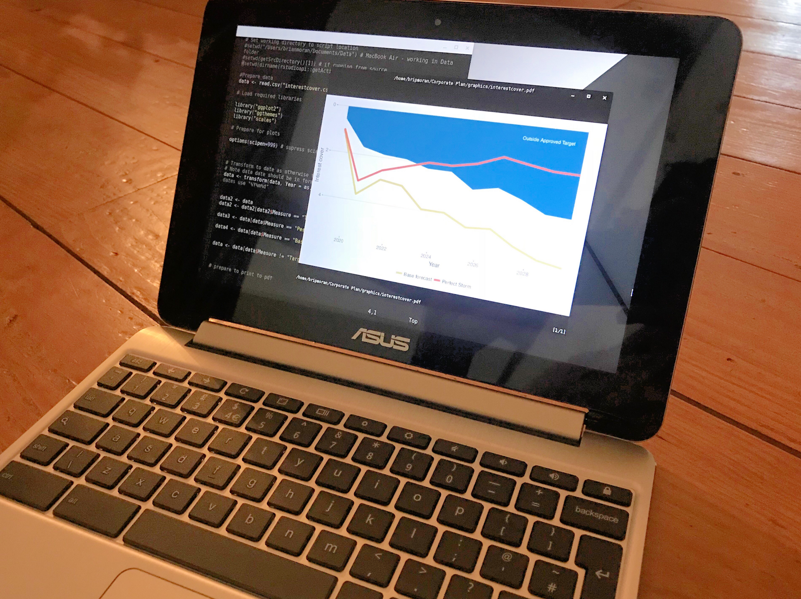

# Linux-on-ASUS-C101PA
Setting up Linux on a dinky Chromebook.



## Aims

The Asus C101PA is a highly portable 10.1 inch Chromebook that is ideal to take on trips: I love its form factor, battery life, the built in security of ChromeOS and low cost of replacement.

With Crostini moving into the stable ChromeOS channel we have an opportunity to add some Linux programmes to boost the usefulness of the C101PA.  Unfortunately the hard drive is only 16 GB so space is at a premium.  We will therefore have to be very careful about what we install.

My minimal needs are to have a text editor and working installs of R and LaTeX to enable me to finish off charts and documents on the go... but we'll see what else we can get away with.

## What comes with the standard Linux container?

After creating the Linux container I have 7.1 GB of free space available across the whole machine according to the Files app.

So let's fire up the new Linux terminal app and get to work.

To see what we are dealing with here:

```lsb_release -da```

It's Debian stretch 9.5.

```apt list --installed```

will show us what we already have installed.  Most notably (for me) we already have Vim and Python 3.  I'm very happy to use Vim to edit code and for **all** my text editing - with Python installed, arguably I don't really need R but my knowledge of R is much better... so...

## Install stuff that R packages need

```sudo apt-get install curl libcurl4-openssl-dev libxml2-dev libssl-dev libgdal-dev libproj-dev xorg libx11-dev libglu1-mesa-dev r-cran-rgl```

I now have 5.5 GB available, with Linux comprising 2.9 GB.

```sudo apt-get update```

```sudo apt-get install r-base```

## Install useful R packages

Enter R as a superuser in interactive mode:

```sudo -i R```

Let's install the packages we need in one command:

```install.packages(c("ggplot2","knitr","ggthemes","scales","ggmap","plotly","ggfortify","leaflet","leaflet.extras","rgdal","forecast","treemapify","dbscan","survival","googleVis","rmarkdown","flexdashboard","highcharter","devtools","maptools","treemap","networkD3","visNetwork","DiagrammeR","DT"))```

This will take a while (...an hour or so) as there is a lot to compile.

Not bad, just three packages from my normal setup don't work (excluded from the list above):

- prophet
- arules
- tidyverse

To be honest tidyverse is the main loss here.

```q()``` to exit R

## Install LaTeX

A full install of LaTeX is very large (c. 5 GB!) so we will start with the smallest possible install and then add in the specific additional fonts and packages needed.

Thankfully these days we can start with [TinyTex](https://yihui.name/tinytex/) and then add to its teeny weeny install:

First we need ```wget``` so:

```sudo apt-get install wget``` and then:

```
wget -qO- "https://yihui.name/gh/tinytex/tools/install-unx.sh" \
  | sh -s - --admin --no-path
```

Add the install location to the path to enable us to use ```pdflatex``` from anywhere in the terminal:

```sudo ~/.TinyTeX/bin/*/tlmgr path add```

Now we have 4.7 GB left to play with.  The size of the Linux container is 3.5 GB.

Now to add the extra packages I need using ```tlmgr install```:

```tlmgr install subfiles isodate substr enumitem datatool xfor fp pdfpages csquotes microtype hyphenat xcolor fancyhdr lastpage fira mweights fontaxes wrapfig capt-of mdframed needspace tcolorbox pgf environ trimspaces titlesec titlecaps ifnextok floatrow placeins adjustbox collectbox lcg relsize lineno pgfplots xltxtra float tabulary```

These are the very specific packages I need for the LaTeX templates I have created.  Your mileage **will** vary - try to compile your .tex files and install the .sty files that the error messages indicate are missing through ```tlmgr install```.

**Note:** I have encountered occassional problems when adding additional packages in this way after the initial install - specifically, packages may not be recognised as installed.  Running ```sudo mktexlsr``` sorts this out though.

Now we have 4.7 GB left to play with.  The size of the Linux container is 3.6 GB... not sure why the overall space has stayed the same... TinyTex clearly does an excellent job of staying tiny!

## Additional goodies

### Pandoc

A command line tool to convert between document types.  The version available in Debian stretch is unfortunately very old.  As the C101PA is an ARM Chromebook we would need to compile the newer version which requires a (1GB +) Haskell install.  We might actually have space to do this... I'll probably try it later, but in the meantime we'll make do with the older version:

```sudo apt-get install pandoc```

And ```pandoc --version``` confirms that the version is 1.17.2.

### EPS2PGF

A handy tool for converting .eps to .pgf which can easily be included in LaTeX without using ```\include{graphics}```.  This is handy when creating templates where you want to ensure a graphic - say a logo - is always present as intended.

EPS2PGF requires Java version 1.5 but ```java -version``` tells us we have version 1.8.0_181 installed so we should be OK.

So in regular ChromeOS head to https://sourceforge.net/projects/eps2pgf/files/latest/download and download.

Mount the zip file, make an EPS2PGF folder on your Linux area and copy over using the Files app.  The command to use EPS2PGF is:

```java -jar eps2pgf.jar input.eps -m directcopy -o output.pgf```

At the minute this would need to be run from the EPS2PGF folder we just created.

### Ghostscript

Ghostscript is already present in the Linux install but it's worth highlighting here as it is a really useful tool to shrink down pdf files and we need to keep space saved afterall:

```gs -dSAFER -dBATCH -dNOPAUSE -dNOCACHE -sDEVICE=pdfwrite     -sColorConversionStrategy=/LeaveColorUnchanged      -dAutoFilterColorImages=true     -dAutoFilterGrayImages=true     -dDownsampleMonoImages=true     -dDownsampleGrayImages=true     -dDownsampleColorImages=true     -sOutputFile=document_flat.pdf orig.pdf```

### Zathura

It's a bit of a pain having to flip back and forth to a browser to view compiled pdfs.  I prefer to use Zathura from the terminal or from Vim, especially because it uses Vim key bindings.

```sudo apt-get install zathura```

### Feh

To launch an image viewer from the terminal:

```sudo apt-get install feh```

### Gimp

I need to edit graphics so:

```sudo apt-get install gimp```

### Inkscape

For vector graphic work:

```sudo apt-get install inkscape```

### Libre Office

A large 602 MB install really just so I have a reliable Excel alternative that I probably don't need anyway...

```sudo apt-get install libreoffice```

### SQLite

Occassionally I might have a need to create small databases and to manipulate stuff in SQL so:

```sudo apt-get install sqlite3 libsqlite3-dev```

And some software to help with this:

```sudo apt-get install sqlitebrowser```

## Scores on the doors

The additional software has taken our Linux install up nearly a whole GB to 4.7 GB mostly thanks to Libre Office but we still have 3.4 GB free.

## Fine tuning

### Git

Set up git config:

```
git config --global user.name "John Doe"
git config --global user.email johndoe@example.com
```

Confirm:

```
git config --list
```

Create SSH key:

```ls -al ~/.ssh
# Lists the files in your .ssh directory, if they exist
```

If none exist:

```
ssh-keygen -t rsa -b 4096 -C "your_email@example.com"
```

Show contents of public key to copy to add to web git service:

```
cat ~/.ssh/id_rsa.pub
```
Add SSH key to webservice and then clone repo using SSH in the area you want it on your computer:

```
git clone git@gitlab.com:YOURGITUSERNAME/YOURREPO.git
```

### Customising Vim

I like the hybrid material colour scheme so let's set that up and a few other things.

Let's install VimPlug:

```
curl -fLo ~/.vim/autoload/plug.vim --create-dirs \
    https://raw.githubusercontent.com/junegunn/vim-plug/master/plug.vim
```

Then create .vimrc file:

```cd```
```vim .vimrc```

**Assuming you are comfortable with Vim**, edit the file using Vim:

```vim .vimrc```

Add the following into the file:

```
set number
syntax on

call plug#begin()

       Plug 'flazz/vim-colorschemes'
       
 call plug#end()

set background=dark
colorscheme hybrid_material

:setlocal spell spelllang=en_gb
```
And then from within Vim type:

```:source %``` and then
```:PlugInstall```

Let Vim do its stuff.

## Concluding thoughts

We now have a little machine with:

- Vim for writing documents and scripting
- R for analysis and to produce top notch charts and HTML dashboards
- LaTeX to create beautiful PDF documents
- Pandoc to convert between document types
- Zathura as a light weight PDF viewer
- Gimp as a powerful graphics editor
- Inkscape for vector graphics
- Libre Office providing a full office suite

Add to this all that the C101PA already offers through ChromeOs and Android and we are very close to having the perfect little machine for my needs... There are just two things missing:

### RStudio

I'd like to get an RStudio server running on the machine as it would be great to be able to use RStudio through the Chromebook browser.  The issue is that RStudio isn't available for ARM processors.  It [looks like someone has had a crack at this](https://github.com/dashaub/ARM-RStudio) but I'm not brave enough to try it out just now.

### KeyNote

I love KeyNote on MacOS.  It's what made me start to use Macs and it's kept me using them.  No other presentation software comes close in my opinion.

For a while I was interested enough by [reveal.js](https://revealjs.com/#/) to create my own templates and delivered a few presentations through it.  Unfortunately though it is a bit clunky to use and to share with others.  You can't collaborate with anyone unless they know a bit of HTML and most the people I collaborate with on presentations don't.

The web version of KeyNote itself is still just a little too awkward to use in a browser and in fact the service states that the browser in this Chromebook is in fact unsupported.

If Linux were to ever get a good KeyNote alternative I'd happily jump to a Linux enabled Chromebook as my daily driver.

Until that happens though, I'd much rather travel with a £250 Chromebook than with a £1,000+ Mac and this set up gets me 95% of the tools that I need.
